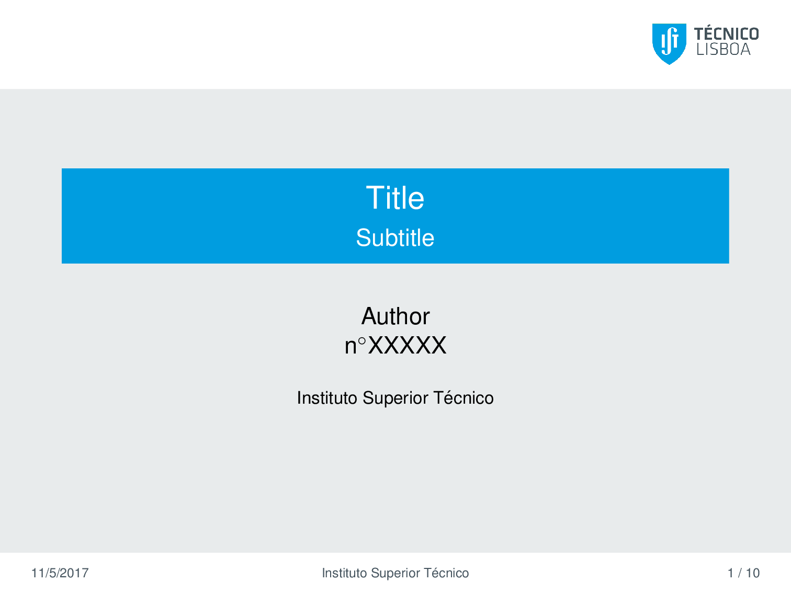
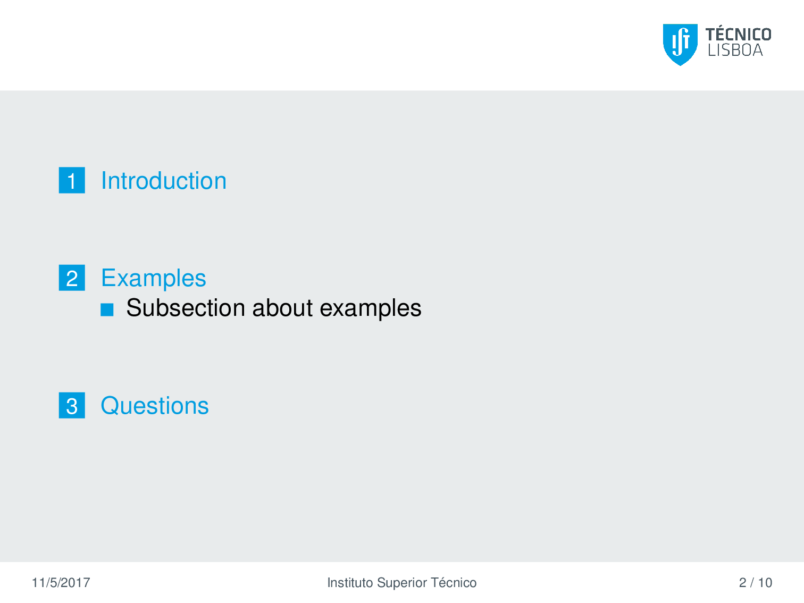
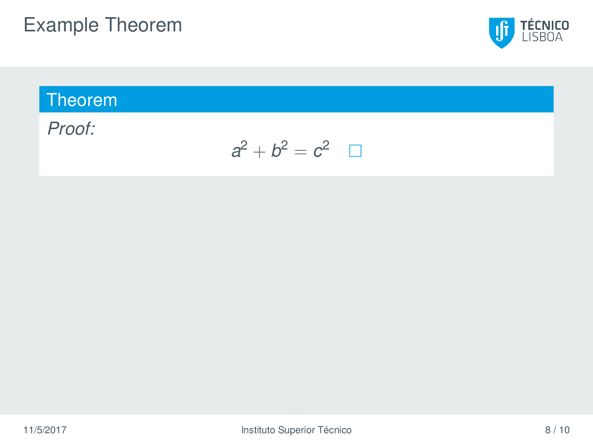

# Beamer IST

A LaTeX Beamer template in the style of [IST's presentation templates](https://tecnico.ulisboa.pt/pt/sobre-o-tecnico/institucional/logo-e-manual-de-identidade/).

## Screenshots


---

---


## Scripts

If you have the complete LaTeX environment installed, you can generate the PDF:

```shell
./gen-pdf.sh
```

To clean all the mess (files generated by the compilation process):

```shell
./clean.sh
```

## Credits

Scripts and instructions adapted from [ist-dissertation-latex-template](https://github.com/samfcmc/ist-dissertation-latex-template).

Preamble adapted from [IST-UL MSc Thesis](https://www.overleaf.com/latex/templates/ist-ul-msc-thesis/wrhbmbvzpttw).
